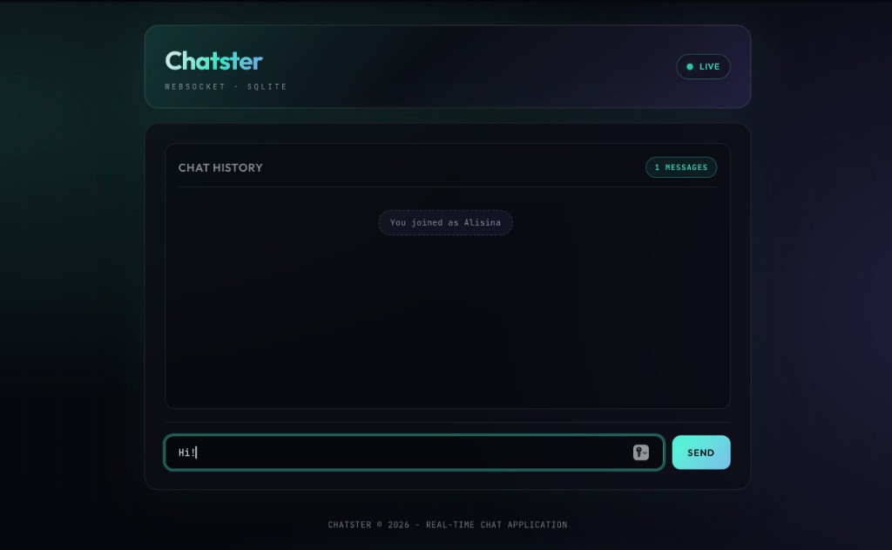

# Chatster

Real-time chat reference stack: **Go** WebSocket hub + **SQLite** history, **React** client, **Docker**-ready, **CI** with lint and coverage, **Prometheus** metrics, and **portfolio-grade** docs (scaling, threat model, ADRs).

[](https://github.com/AliSinaDevelo/Chatster/actions/workflows/ci.yml)

## Preview



## Highlights

- WebSocket broadcast with reconnect, **buffered hub channel**, **per-client write serialization** (safe gorilla/websocket usage).
- Last **50** messages replayed on connect; **SQLite timestamp** parsing supports multiple on-disk formats.
- **`GET /health`** with SQLite ping (503 when degraded); **`GET /metrics`** for Prometheus.
- **Abuse controls:** max username/message size (runes), per-IP **WebSocket upgrade** rate limit, per-client **message** rate limit, optional **`Origin`** allowlist.
- Structured JSON logs (`slog`), graceful shutdown, GitHub Actions (lint, test + coverage, ESLint, build), Dependabot, Docker Compose.

**Frontend** is intentionally a focused CRA SPA—see [docs/FRONTEND.md](docs/FRONTEND.md) for accessibility, performance notes, and how this repo positions **backend/platform** depth vs UI framework churn.

## Quick start

### Option A — Docker (fastest to see the UI)

```bash
docker compose up --build
```

Open **http://localhost:3000** (UI) and **http://localhost:8080/health** (API health).

### Option B — Native (best for development)

**Terminal 1 — API**

```bash
cd backend && go run .
```

**Terminal 2 — React**

```bash
cd frontend && npm install && npm start
```

Open **http://localhost:3000**. Use two browser tabs or windows to test live messaging.

## Configuration

| Variable | Scope | Purpose |
|----------|--------|---------|
| `CHATSTER_HTTP_ADDR` | Backend | Listen address (default `:8080`). |
| `CHATSTER_DB_PATH` | Backend | SQLite file (default `./chatster.db`). |
| `CHATSTER_ALLOWED_ORIGINS` | Backend | Comma-separated `Origin` values for WebSocket; **empty = allow all** (dev only). |
| `CHATSTER_WS_UPGRADE_RPS` | Backend | WS upgrades per IP per second (default `5`; `0` disables). |
| `CHATSTER_WS_UPGRADE_BURST` | Backend | Token bucket burst for WS upgrades (default `10`). |
| `CHATSTER_MESSAGE_RPS` | Backend | Chat messages per client per second (default `5`; `0` disables). |
| `CHATSTER_MESSAGE_BURST` | Backend | Token bucket burst for per-client message sends (default `10`). |
| `REACT_APP_WS_URL` | Frontend build | Full WebSocket URL (production / Docker build args). |
| `REACT_APP_WS_PORT` | Frontend dev | Backend port when using default dev WebSocket URL. |

See `backend/.env.example` and `frontend/.env.example`.

## Scripts

| Command | Description |
|---------|-------------|
| `make test` | Backend tests + frontend tests (CI mode). |
| `make lint` | golangci-lint + ESLint (requires golangci-lint installed locally). |
| `make docker-up` | `docker compose up --build`. |
| `cd backend && go test -race ./...` | Go tests (includes HTTP + WebSocket integration tests). |
| `cd frontend && npm run test:ci` | Jest once. |
| `cd frontend && npm run build` | Optimized static build. |

## Documentation

- [Architecture](docs/ARCHITECTURE.md) — components, data flow.
- [Scaling & failure modes](docs/SCALING.md) — what breaks first, what to do next.
- [Threat model](docs/THREAT_MODEL.md) — security narrative and controls.
- [Observability](docs/OBSERVABILITY.md) — metrics, logs, SLO sketch, tracing path.
- [Frontend engineering](docs/FRONTEND.md) — a11y, perf budget, positioning.
- [Non-goals](docs/NON_GOALS.md) — explicit out-of-scope items.
- [ADR index](docs/adr/README.md) — architecture decisions.
- [Workflows](docs/WORKFLOWS.md) — CI, Dependabot, local and Docker dev.
- [Operations](docs/OPERATIONS.md) — probes, `/metrics`, checklist.
- [Contributing](CONTRIBUTING.md) — PRs, `make lint`, code of conduct.

## Stack

Go 1.22 · Gorilla Mux & WebSocket · SQLite (CGO) · Prometheus · React 18 · Sass · Docker · GitHub Actions.

## License

See [LICENSE](LICENSE).
