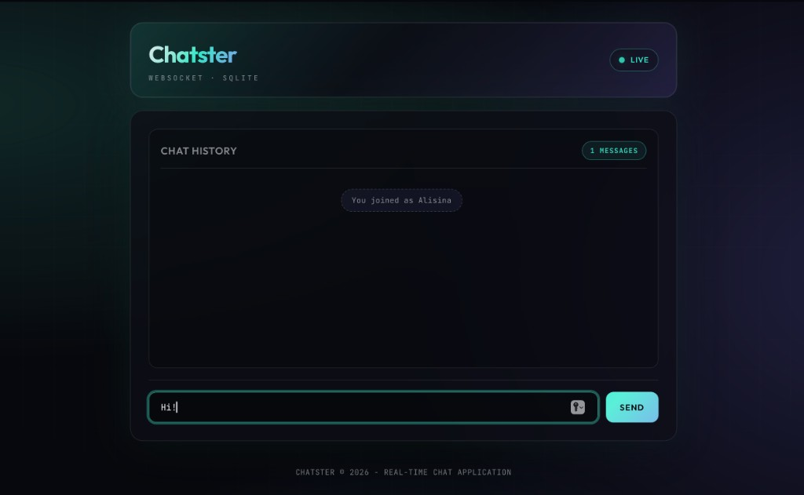
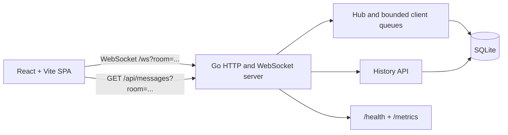

# Chatster

Real-time chat reference stack: **Go** WebSocket hub + repository-backed history (**SQLite** by default, optional **Postgres**), **React** client, single-service **Docker** production image, **CI** with lint and coverage, **Prometheus** metrics, and **portfolio-grade** docs (scaling, threat model, ADRs).

[](https://github.com/AlisinaDevelo/Chatster/actions/workflows/ci.yml)

## Preview



## Highlights

- WebSocket broadcast with reconnect, **buffered hub channel**, **bounded per-client outbound queues**, and safe gorilla/websocket write serialization.
- Room-scoped chat and history, with `general` as the default and selectable `engineering` / `off-topic` rooms in the UI.
- Last **50** messages replayed on connect per room; **SQLite timestamp** parsing supports multiple on-disk formats.
- **`GET /health`** with selected-storage ping (503 when degraded); **`GET /metrics`** for Prometheus.
- **Abuse controls:** max username/message size (runes), per-IP **WebSocket upgrade** rate limit, per-client **message** rate limit, optional **`Origin`** allowlist.
- Structured JSON logs (`slog`), graceful shutdown, GitHub Actions (lint, test + coverage artifact, WebSocket load smoke, ESLint, build, production image smoke), Dependabot, Docker Compose, single-service production image.
- **Measured:** zero message loss with **p99 ≈ 6 ms** broadcast delivery at 25 concurrent clients, and zero loss at 50 (Apple M1, Go 1.26); reproducible harness and honest O(N²) fan-out scaling notes in [docs/LOAD_TESTING.md](docs/LOAD_TESTING.md).

**Frontend** is intentionally a focused Vite + React SPA—see [docs/FRONTEND.md](docs/FRONTEND.md) for accessibility, performance notes, and how this repo positions **backend/platform** depth vs UI framework churn.

## Architecture at a glance


```mermaid
flowchart LR
  Browser[React + Vite SPA] -->|WebSocket /ws?room=...| Server[Go HTTP and WebSocket server]
  Browser -->|GET /api/messages?room=...| Server
  Server --> Hub[Hub and bounded client queues]
  Server --> History[History API]
  Hub --> SQLite[(SQLite)]
  History --> SQLite
  Server --> Health["/health + /metrics"]
```

The server validates and rate-limits WebSocket input, persists accepted messages by room, and enqueues fan-out only to clients in that room. The same process serves the built SPA, room-filtered reconnect history, health checks, and Prometheus metrics. See [docs/ARCHITECTURE.md](docs/ARCHITECTURE.md) for the message flow, lifecycle states, and scaling boundaries.

## Measured results

The load harness measures real delivered fan-out frames, not client-side enqueue speed. Results below use a fresh SQLite database, disabled demo limiters, and an Apple M1 with Go 1.26.3 on macOS 26.5.1 (2026-06-24).

| Concurrent clients | Delivered | Lost | Throughput | p99 delivery latency |
|-------------------:|----------:|-----:|-----------:|---------------------:|
| 25 | 12,500 / 12,500 | 0 | ~121,000/s | 5.7 ms |
| 50 | 50,000 / 50,000 | 0 | ~314,000/s | 57 ms |

The broadcast path is intentionally single-node and O(clients²). The harness, exact commands, and why no unstable 100-client claim is published are documented in [docs/LOAD_TESTING.md](docs/LOAD_TESTING.md).

## Quick start

### Option A — Docker (fastest to see the UI)

```bash
docker compose up --build
```

Open **http://localhost:3000** (UI) and **http://localhost:8080/health** (API health).

### Option B — Production-style single container

```bash
docker build -t chatster:prod .
docker run --rm -p 8080:8080 -v chatster-data:/data chatster:prod
```

Open **http://localhost:8080**. The Go backend serves the React build, API, metrics, and WebSocket from one origin.

### Option C — Native (best for development)

**Terminal 1 — API**

```bash
cd backend && go run .
```

**Terminal 2 — React**

```bash
cd frontend && npm install && npm start
```

Open **http://localhost:3000**. Use two browser tabs or windows to test live messaging.

### Two-tab smoke

1. Open the UI in two tabs.
2. Join each tab with a different display name.
3. Keep both tabs in **#general**, send a message, and confirm both histories update.
4. Switch one tab to **#engineering**, send a message, and confirm the #general tab does not receive it.
5. Refresh the engineering tab and confirm room history catches up after reconnect.

The production path serves the UI and API from one origin; CI builds and smoke-tests that container on every push.

## Deployment status

The root Docker image and checked-in [`render.yaml`](render.yaml) are ready for a single-instance Render deployment with a persistent SQLite disk. A public URL is intentionally not listed until the repository is connected to a Render account and the deployed origin is configured in `CHATSTER_ALLOWED_ORIGINS`; see [docs/DEPLOYMENT.md](docs/DEPLOYMENT.md) for the HTTP and browser smoke commands.

## Configuration

| Variable | Scope | Purpose |
|----------|--------|---------|
| `CHATSTER_HTTP_ADDR` | Backend | Listen address; if unset, use numeric `PORT` or default to `:8080`. |
| `CHATSTER_STORAGE` | Backend | `sqlite` by default; set to `postgres` to opt into the pooled Postgres repository. Unknown values fail startup. |
| `CHATSTER_DB_PATH` | Backend | SQLite file (default `./chatster.db`); used when storage is `sqlite`. |
| `CHATSTER_POSTGRES_DSN` | Backend secret | Postgres connection string; required when storage is `postgres` and never logged. |
| `CHATSTER_POSTGRES_MIN_CONNS` / `CHATSTER_POSTGRES_MAX_CONNS` | Backend | Postgres pool bounds (defaults `2` / `10`). |
| `CHATSTER_STATIC_DIR` | Backend | Optional built frontend directory served by the Go backend. |
| `CHATSTER_ALLOWED_ORIGINS` | Backend | Comma-separated `Origin` values for WebSocket; **empty = allow all** (dev only). |
| `CHATSTER_WS_UPGRADE_RPS` | Backend | WS upgrades per IP per second (default `5`; `0` disables). |
| `CHATSTER_WS_UPGRADE_BURST` | Backend | Token bucket burst for WS upgrades (default `10`). |
| `CHATSTER_MESSAGE_RPS` | Backend | Chat messages per client per second (default `5`; `0` disables). |
| `CHATSTER_MESSAGE_BURST` | Backend | Token bucket burst for per-client message sends (default `10`). |
| `CHATSTER_MESSAGE_RETENTION_DAYS` | Backend | Delete persisted messages older than this many days at startup (`0` disables). |
| `CHATSTER_AUDIT_RETENTION_DAYS` | Backend | Delete moderation audit events older than this many days at startup (`0` disables). |
| `VITE_WS_URL` | Frontend build | Full WebSocket URL (production / Docker build args). |
| `VITE_WS_PORT` | Frontend dev | Backend port when using default dev WebSocket URL. |
| `VITE_API_URL` | Frontend build | HTTP API origin when it is separate from the UI. |
| `VITE_API_PORT` | Frontend dev | Backend port when using the default API origin. |

See `backend/.env.example` and `frontend/.env.example`.

## Scripts

| Command | Description |
|---------|-------------|
| `make test` | Backend tests + frontend tests (CI mode). |
| `make lint` | golangci-lint + ESLint (requires golangci-lint installed locally). |
| `make docker-up` | `docker compose up --build`. |
| `docker build -t chatster:prod .` | Build the single-service production image; CI also smokes this path. |
| `./scripts/smoke-deployment.sh <url>` | Verify a deployed or locally running origin's health, rooms, metrics, and history endpoints. |
| `cd backend && go test -race ./...` | Go tests (includes HTTP + WebSocket integration tests). |
| `cd frontend && npm run test:ci` | Vitest once. |
| `cd frontend && npm run build` | Optimized static build. |

## Documentation

- [Architecture](docs/ARCHITECTURE.md) — components, data flow.
- [Scaling & failure modes](docs/SCALING.md) — what breaks first, what to do next.
- [Threat model](docs/THREAT_MODEL.md) — security narrative and controls.
- [Observability](docs/OBSERVABILITY.md) — metrics, logs, SLO sketch, tracing path.
- [Load testing](docs/LOAD_TESTING.md) — reproducible WebSocket load harness.
- [Deployment](docs/DEPLOYMENT.md) — single-container production image and host checklist.
- [Frontend engineering](docs/FRONTEND.md) — a11y, perf budget, positioning.
- [Non-goals](docs/NON_GOALS.md) — explicit out-of-scope items.
- [ADR index](docs/adr/README.md) — architecture decisions.
- [Workflows](docs/WORKFLOWS.md) — CI, Dependabot, local and Docker dev.
- [Operations](docs/OPERATIONS.md) — probes, `/metrics`, checklist.
- [Contributing](CONTRIBUTING.md) — PRs, `make lint`, code of conduct.

## Stack

Go 1.22 · Gorilla Mux & WebSocket · SQLite (CGO) · Prometheus · React 18 · Vite · Vitest · Sass · Docker · GitHub Actions.

## License

See [LICENSE](LICENSE).
