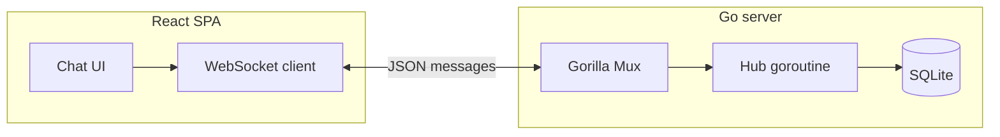

# Architecture

Chatster is a small full-stack demo: a **Go** HTTP server with a **WebSocket** hub, **SQLite** persistence, and a **React** single-page client.

## Components

### Backend (`backend/`)

- **`main.go`**: HTTP server with **graceful shutdown** (SIGINT/SIGTERM), **structured logging** (`log/slog` JSON to stdout), WebSocket upgrade (`/ws`), CORS middleware, and the in-memory **hub** that tracks clients and broadcasts JSON messages.
- **`internal/config`**: Environment-based configuration (`CHATSTER_HTTP_ADDR`, `CHATSTER_DB_PATH`).
- **`db/`**: SQLite access — `messages` table, `SaveMessage`, `GetRecentMessages` (last *N* rows, chronological for the client).

**Message flow**

1. Client opens `GET /ws` → upgraded to WebSocket.
2. First client message with `type: "username"` sets display name; it is not stored as a chat row.
3. Chat messages (`type: "message"`) are saved, then broadcast to all connected clients with `id` and `timestamp` when available.
4. Join/leave **notifications** are persisted like other rows (except the username handshake).

**Operational endpoints**

- `GET /health` — JSON including `status`, `database`, and `service`; **503** when SQLite ping fails (see [OPERATIONS.md](OPERATIONS.md)).
- `GET /` — short plain-text banner.

### Frontend (`frontend/`)

- **`src/api/index.js`**: WebSocket lifecycle — connect, reconnect after close, `disconnect` on React unmount (avoids duplicate sockets under Strict Mode), dev default `ws://127.0.0.1:8080/ws`.
- **`App.js`**: Connection state, username handshake, chat history list.
- **Styling**: SCSS per component plus global tokens in `index.css` (dark glass UI, reduced-motion aware).

## Configuration

| Variable | Where | Purpose |
|----------|--------|---------|
| `CHATSTER_HTTP_ADDR` | Backend | Listen address (default `:8080`). |
| `CHATSTER_DB_PATH` | Backend | SQLite file path (default `./chatster.db`). |
| `REACT_APP_WS_URL` | Frontend build | Full WebSocket URL override (production). |
| `REACT_APP_WS_PORT` | Frontend dev | Backend port when using default dev URL. |

See `frontend/.env.example`.

## Security notes (demo scope)

- WebSocket `CheckOrigin` allows all origins — convenient for local dev; **tighten** before any public deployment.
- SQLite file path is relative (`./chatster.db`); use a volume or absolute path in production.

## Possible extensions

- JWT or session auth, rooms, rate limits, message pagination, and hub-level drain on shutdown.
