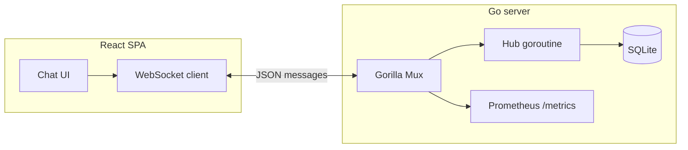

# Architecture

Chatster is a small full-stack demo: a **Go** HTTP server with a **WebSocket** hub, **SQLite** persistence, and a **React** single-page client.

## Components

### Backend (`backend/`)

- **`main.go`**: HTTP server with **graceful shutdown**, **`log/slog`** JSON logs, routes, WebSocket upgrade (`/ws`), CORS, **Prometheus `/metrics`**, and the **hub** (`Hub.run`) that registers clients and broadcasts JSON.
- **`internal/config`**: `CHATSTER_*` environment variables (listen address, DB path, **Origin allowlist**, **WS upgrade rate limit**).
- **`internal/metrics`**: Prometheus metric definitions (`chatster_*`).
- **`internal/ratelimit`**: Per-IP token bucket for WebSocket **upgrade** attempts.
- **`db/`**: SQLite — `messages` table, `SaveMessage`, `GetRecentMessages` with **flexible timestamp parsing** (RFC3339 and legacy layouts).

**Message flow**

1. Client opens `GET /ws` → upgraded (subject to **rate limit** and **`Origin`** policy when configured).
2. First client message with `type: "username"` sets display name; not stored as a chat row.
3. Client payloads are validated (**max runes** for username and message body); non-`message` types from clients are coerced to `message` to reduce spoofing of server-only notification types.
4. Chat messages are saved (when possible), then broadcast with `id` and `timestamp` when available.
5. Join/leave notifications are persisted like other rows (except the username handshake).

**Concurrency**

- **`broadcast`** uses a **buffered** channel so a client’s read loop does not deadlock when the hub writes back to the same socket (see [adr/0005](adr/0005-broadcast-channel-and-writer-lock.md)).
- All server writes to a given `*websocket.Conn` go through **`Client.writeJSON`** (mutex) because **gorilla/websocket** permits only one concurrent writer per connection (history replay + hub broadcast can otherwise race).

**Operational endpoints**

- `GET /health` — JSON `status` / `database` / `service`; **503** when SQLite ping fails ([OPERATIONS.md](OPERATIONS.md)).
- `GET /metrics` — Prometheus exposition ([OBSERVABILITY.md](OBSERVABILITY.md)).
- `GET /` — plain-text banner.

### Frontend (`frontend/`)

- **`src/api/index.js`**: WebSocket lifecycle, reconnect, `disconnect` on unmount.
- **`App.js`**: Connection state, username handshake, message list.
- **Styling**: SCSS + tokens; **accessibility** notes in [FRONTEND.md](FRONTEND.md).

## Configuration

| Variable | Where | Purpose |
|----------|--------|---------|
| `CHATSTER_HTTP_ADDR` | Backend | Listen address (default `:8080`). |
| `CHATSTER_DB_PATH` | Backend | SQLite file path (default `./chatster.db`). |
| `CHATSTER_ALLOWED_ORIGINS` | Backend | Comma-separated `Origin` allowlist; **empty = allow all** (dev). |
| `CHATSTER_WS_UPGRADE_RPS` / `CHATSTER_WS_UPGRADE_BURST` | Backend | Per-IP WebSocket upgrade limiter (`RPS=0` disables). |
| `REACT_APP_WS_URL` | Frontend build | Full WebSocket URL override (production). |
| `REACT_APP_WS_PORT` | Frontend dev | Backend port when using default dev URL. |

See `backend/.env.example` and `frontend/.env.example`.

## Security notes (demo scope)

- See **[THREAT_MODEL.md](THREAT_MODEL.md)** for STRIDE-style threats, TLS, abuse, and auth gaps.
- Set **`CHATSTER_ALLOWED_ORIGINS`** in any shared environment; empty means browsers can connect from any origin.
- **No authentication** in scope ([adr/0003](adr/0003-no-auth-demo-scope.md)); usernames are display strings only.

## Scaling and extensions

- **[SCALING.md](SCALING.md)** — failure order, SQLite limits, multi-instance options.
- **[NON_GOALS.md](NON_GOALS.md)** — explicit exclusions.
- Code ideas: JWT/session auth, rooms, hub drain on shutdown, OpenTelemetry ([OBSERVABILITY.md](OBSERVABILITY.md)).
