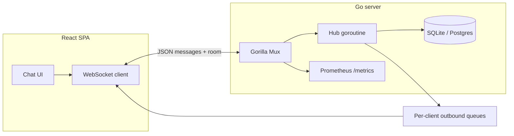
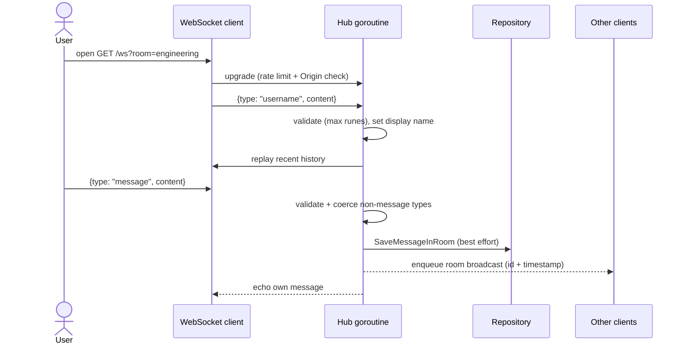
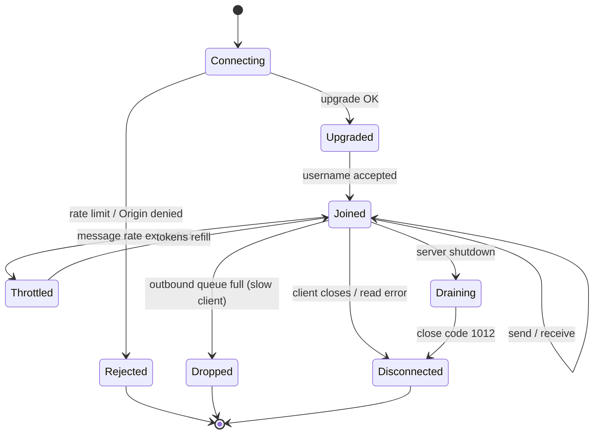
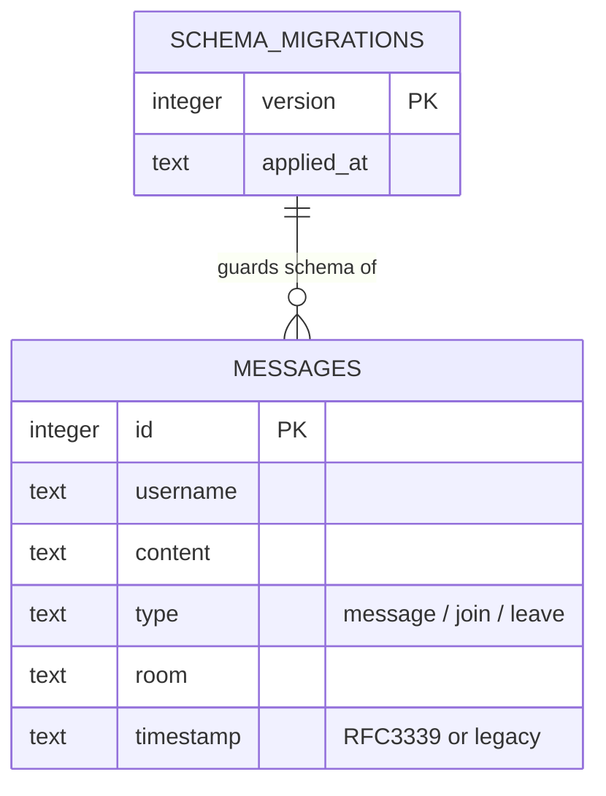

# Architecture

Chatster is a small full-stack demo: a **Go** HTTP server with a room-scoped **WebSocket** hub, repository-backed persistence (**SQLite** by default, optional **Postgres**), and a **React** single-page client. The default room is `general`; the frontend currently offers `general`, `engineering`, and `off-topic`.

## Components

```mermaid
flowchart LR
  subgraph client [React SPA]
    UI[Chat UI]
    WSClient[WebSocket client]
  end
  subgraph server [Go server]
    Mux[Gorilla Mux]
    Hub[Hub goroutine]
    DB[(SQLite / Postgres)]
    Prom[Prometheus /metrics]
  end
  UI --> WSClient
  WSClient <-->|JSON messages + room| Mux
  Mux --> Hub
  Mux --> Prom
  Hub --> DB
  Hub --> Queues[Per-client outbound queues]
  Queues --> WSClient
```

### Backend (`backend/`)

- **`main.go`**: HTTP server with **graceful shutdown**, explicit WebSocket hub draining, **`log/slog`** JSON logs, routes, room-aware WebSocket upgrade (`/ws?room=...`), CORS, **Prometheus `/metrics`**, and the **hub** (`Hub.run`) that manages client lifecycle and broadcasts JSON within a room.
- **`internal/config`**: `CHATSTER_*` environment variables (listen address, storage selection and pool settings, **Origin allowlist**, **WS upgrade and message rate limits**).
- **`internal/metrics`**: Prometheus metric definitions (`chatster_*`).
- **`internal/ratelimit`**: Per-IP token bucket for WebSocket **upgrade** attempts.
- **`db/`**: the storage repository boundary, with ordered SQLite migrations, an optional `pgxpool` Postgres adapter, room-scoped history, moderation audit persistence, retention, and health checks. SQLite retains **flexible timestamp parsing** for legacy rows.

**Message flow**

1. Client opens `GET /ws?room=<name>` → the room name is normalized and upgraded (blank means `general`; subject to **rate limit** and **`Origin`** policy when configured).
2. First client message with `type: "username"` sets display name; not stored as a chat row.
3. Client payloads are validated (**max runes** for username and message body); non-`message` types from clients are coerced to `message` to reduce spoofing of server-only notification types.
4. Chat messages are saved (when possible), then broadcast with `room`, `id`, and `timestamp` when available to clients in the same room.
5. Join/leave notifications are persisted and broadcast within the room like other rows (except the username handshake).

Room names are validated as short ASCII identifiers by the backend. The frontend keeps the active room in `/rooms/<name>`, preserves it across reconnect/history requests, and exposes a small preset list through the header selector.

```mermaid
sequenceDiagram
  actor User
  participant WS as WebSocket client
  participant Hub as Hub goroutine
  participant DB as Repository
  participant Peers as Other clients

  User->>WS: open GET /ws?room=engineering
  WS->>Hub: upgrade (rate limit + Origin check)
  WS->>Hub: {type: "username", content}
  Hub->>Hub: validate (max runes), set display name
  Hub->>WS: replay recent history
  User->>WS: {type: "message", content}
  Hub->>Hub: validate + coerce non-message types
  Hub->>DB: SaveMessageInRoom (best effort)
  Hub-->>Peers: enqueue room broadcast (id + timestamp)
  Hub-->>WS: echo own message
```

**Concurrency**

- **`broadcast`** uses a **buffered** channel so a client’s read loop does not deadlock when the hub writes back to the same socket (see [adr/0005](adr/0005-broadcast-channel-and-writer-lock.md)).
- Registration is guarded by the hub mutex and rejected once draining begins; the event loop owns broadcast and unregister processing.
- The hub does **not** write directly to sockets during fan-out. It enqueues messages into each client's bounded outbound queue (see [adr/0006](adr/0006-bounded-client-outbound-queues.md)).
- The hub filters fan-out by the client's selected room before enqueueing, so a message in one room is not delivered to another room.
- Each client has one writer goroutine. All server writes to a given `*websocket.Conn` still go through **`Client.writeJSON`** (mutex) because **gorilla/websocket** permits only one concurrent writer per connection (queued messages + heartbeat control frames can otherwise race).
- A full outbound queue is treated as a slow-client failure: the server disconnects that client and increments `chatster_websocket_outbound_drops_total{reason="slow_client"}`.

**Shutdown lifecycle**

- SIGINT/SIGTERM atomically puts the hub into **draining** mode before the HTTP shutdown deadline begins; new WebSocket upgrades receive HTTP **503** and are not registered.
- Existing clients receive WebSocket close code **1012 (service restart)** with the reason `server shutting down`, then their socket is closed so blocked read/write loops can finish.
- The hub waits for client read-loop completion and stops its run goroutine. If the shared 30-second shutdown context expires, remaining clients are counted as forced closes and the process continues its final HTTP shutdown.
- Drain logs include only client counts, duration, close code, and forced-close counts. Message bodies are never included.

**Client connection lifecycle**

```mermaid
stateDiagram-v2
  [*] --> Connecting
  Connecting --> Upgraded: upgrade OK
  Connecting --> Rejected: rate limit / Origin denied
  Upgraded --> Joined: username accepted
  Joined --> Joined: send / receive
  Joined --> Throttled: message rate exceeded
  Throttled --> Joined: tokens refill
  Joined --> Dropped: outbound queue full (slow client)
  Joined --> Disconnected: client closes / read error
  Joined --> Draining: server shutdown
  Draining --> Disconnected: close code 1012
  Rejected --> [*]
  Dropped --> [*]
  Disconnected --> [*]
```

**Operational endpoints**

- `GET /health` — JSON `status` / `database` / `service`; **503** when the selected repository ping fails ([OPERATIONS.md](OPERATIONS.md)).
- `GET /metrics` — Prometheus exposition ([OBSERVABILITY.md](OBSERVABILITY.md)).
- `GET /` — plain-text banner.

### Frontend (`frontend/`)

- **`src/api/index.js`**: Room-aware WebSocket lifecycle, reconnect, history fetches, and `disconnect` on unmount.
- **`App.jsx` / `src/rooms.js`**: Connection state, URL-backed room selection, username handshake, and message list.
- **Styling**: SCSS + tokens; **accessibility** notes in [FRONTEND.md](FRONTEND.md).

### Data model

The selected repository is migrated forward by an ordered `schema_migrations` ledger; chat
rows live in `messages`. The handshake username message is the only payload not stored as a
row. Postgres migrations take a database advisory lock so concurrent replicas do not apply
the same version twice.

```mermaid
erDiagram
  SCHEMA_MIGRATIONS ||--o{ MESSAGES : "guards schema of"
  MESSAGES {
    integer id PK
    text    username
    text    content
    text    type "message / join / leave"
    text    room
    text    timestamp "RFC3339 or legacy"
  }
  SCHEMA_MIGRATIONS {
    integer version PK
    text    applied_at
  }
```

## Configuration

| Variable | Where | Purpose |
|----------|--------|---------|
| `CHATSTER_HTTP_ADDR` | Backend | Listen address; if unset, use numeric `PORT` or default to `:8080`. |
| `CHATSTER_STORAGE` | Backend | `sqlite` by default; `postgres` selects the pooled Postgres repository. |
| `CHATSTER_DB_PATH` | Backend | SQLite file path (default `./chatster.db`), used only for SQLite. |
| `CHATSTER_POSTGRES_DSN` | Backend secret | Required for Postgres; never logged. |
| `CHATSTER_POSTGRES_MIN_CONNS` / `CHATSTER_POSTGRES_MAX_CONNS` | Backend | Postgres pool bounds (defaults `2` / `10`). |
| `CHATSTER_ALLOWED_ORIGINS` | Backend | Comma-separated `Origin` allowlist; **empty = allow all** (dev). |
| `CHATSTER_WS_UPGRADE_RPS` / `CHATSTER_WS_UPGRADE_BURST` | Backend | Per-IP WebSocket upgrade limiter (`RPS=0` disables). |
| `CHATSTER_MESSAGE_RPS` / `CHATSTER_MESSAGE_BURST` | Backend | Per-client chat message limiter (`RPS=0` disables). |
| `CHATSTER_MESSAGE_RETENTION_DAYS` | Backend | Startup cleanup for messages older than the configured age (`0` disables). |
| `CHATSTER_AUDIT_RETENTION_DAYS` | Backend | Startup cleanup for moderation audit events older than the configured age (`0` disables). |
| `VITE_WS_URL` | Frontend build | Full WebSocket URL override (production). |
| `VITE_WS_PORT` | Frontend dev | Backend port when using default dev URL. |
| `VITE_API_URL` | Frontend build | HTTP API origin when it is separate from the UI. |
| `VITE_API_PORT` | Frontend dev | Backend port when using the default API origin. |

See `backend/.env.example` and `frontend/.env.example`.

## Security notes (demo scope)

- See **[THREAT_MODEL.md](THREAT_MODEL.md)** for STRIDE-style threats, TLS, abuse, and auth gaps.
- Set **`CHATSTER_ALLOWED_ORIGINS`** in any shared environment; empty means browsers can connect from any origin.
- **No authentication** in scope ([adr/0003](adr/0003-no-auth-demo-scope.md)); usernames are display strings only.

## Scaling and extensions

- **[SCALING.md](SCALING.md)** — failure order, SQLite limits, multi-instance options.
- **[NON_GOALS.md](NON_GOALS.md)** — explicit exclusions.
- Code ideas: JWT/session auth, presence, OpenTelemetry ([OBSERVABILITY.md](OBSERVABILITY.md)).
